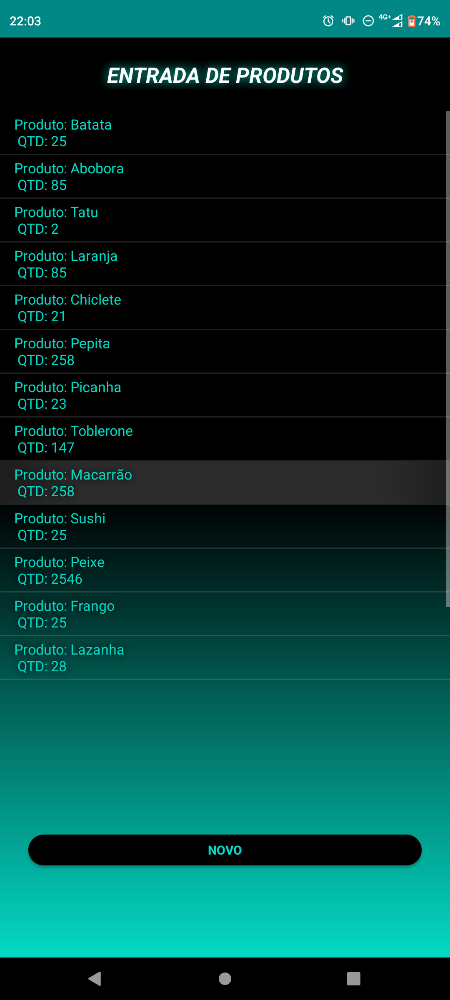
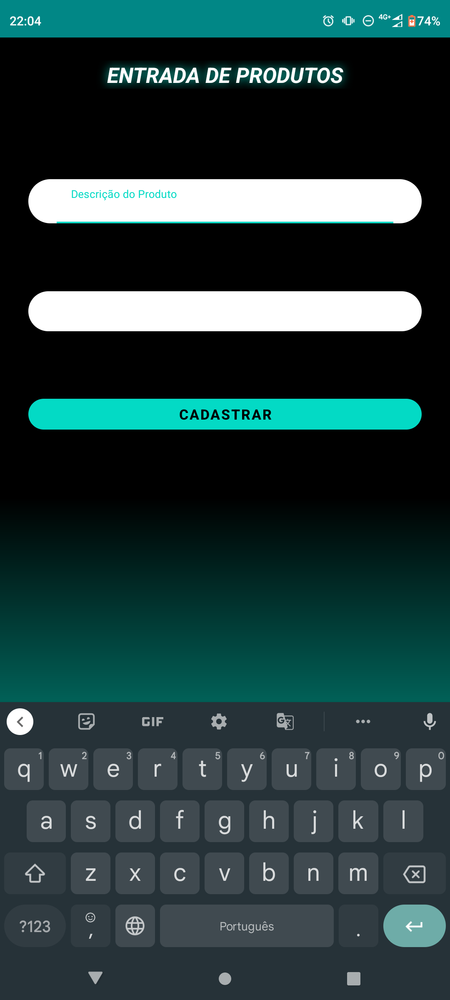
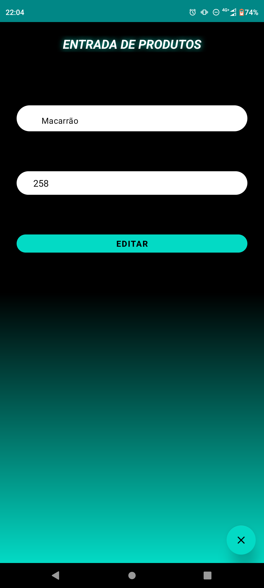
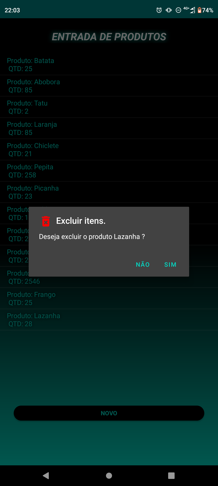

# Controle-De-Estoque-Java
## Software desenvolvido juntamente com Eloizi Nogueira (https://github.com/Eloizi)
 - Trabalho avaliativo desenvolvido em sala de aula
 - Data de inicio: 10 de Novembro de 2022
 - Data de finalização: 10 de Novembro de 2022

 ## Descrição
    O intuíto do projeto é armazenar uma descrição e um quantidade do produto dentro do 
    banco de dados SQLite.
    Além de armazenar o software deve tambem realizar as demais três operações de um CRUD. 
    Os dados cadastrados são listados   na activity principal através de um Lisview.
    O projeto foi desenvolvido a Linguagem Java e com a plataforma de desenvolvimento 
    Android Studio.

## Página inicial    

## Página de cadastro 
  
## Página de atualização do produto  
 - A janela de edição é a mesma do cadastro porém são carregadas de formas diferentes para cada caso
  
## Apagando itens
 - Os itens são excluidos com um click longo no itens desejado

## Vídeo de apresentação   

 
               